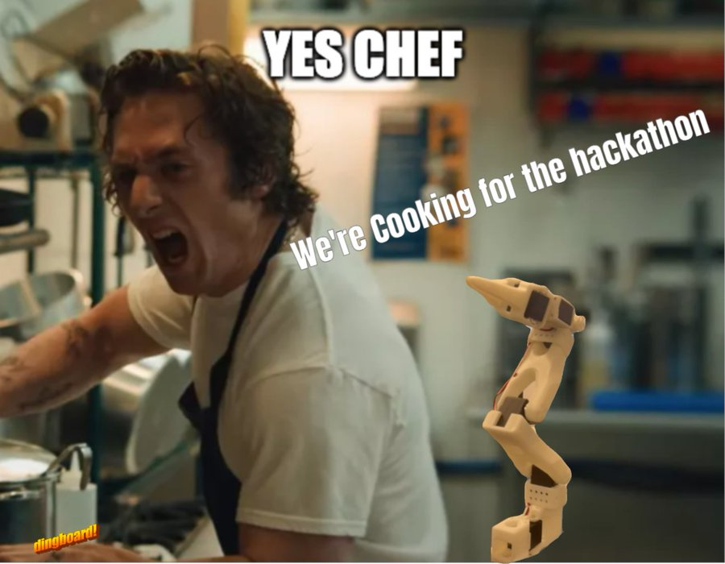

# Yes Chef! 

This repo covers everything you need to create and run your very own multimodal animatronic robot capable of responding to your voice commands. Although some aspects rely on readily available products and services, this project overwhelmingly builds upon on Open Source efforts, to include the robotic arm itself. 

**WARNING**: Our robot may be cute, but he is not suitable for children. As presented this will create a robot that is extremely foul mouthed and will mercilessly insult you. His words cut deep. You have been warned.  

# Prerequisites 

**Cartesia API Key** for TTS 
https://play.cartesia.ai/  
FYI - during this entire process (24 hours) we consumed 17911 characters.  

**Weights and Biases Weave API Key** for observability & tracing  
https://wandb.ai/authorize  
https://wandb.me/weave - FYI here are the docs  

**Google Gemini API Key** for LLM interactions  
https://ai.google.dev/gemini-api  

**Picovoice** for the wake word  
https://picovoice.ai/docs/porcupine/   
 
Once you have setup the prerequisites, you will need to move `example.env` to `.env` and update the variables accordingly.

# Hardware 

While this effort is focused on the [SO-ARM100 v1.2](https://github.com/TheRobotStudio/SO-ARM100), there is no reason why any other Open Source robotic arm could not be used, albeit with minor modifications. Our results can be entirely reproduced using only a follower arm, so the leader arm can be ignored for this project.  The following is required:  

 - Robotic Arm (e.g., SO-ARM100 v1.2)
 - A server (laptop, Raspberry Pi, etc.)
 - Webcam (to see what Chef is going to be insulting)
 - Microphone (ours came with our webcam)
 - A Speaker (for all audio)

# Hardware Configuration 

This entire project was inspired by, and would not have been possible without HuggingFace's incredible [LeRobot](https://github.com/huggingface/lerobot). LeRobot includes scripts to help you setup your servos during the build process, as well as identify things on your host like port configurations. Additionally, the related libraries greatly simplify interactions. In short, without LeRobot we wouldn't have been able to enable the overwhelming majority of the functionality that you see here.  

**IMPORTANT!!!**  

A lot of the configuration that we have in place expects that you will have appropriately setup and configured your robotic arm. Generally speaking, the steps for this vary greatly, but in this case, there may be additional considerations for your specific robotic arm and and potential puppet that you have in place as well. In short, please be diligent to ensure that you have performed all necessary steps *for your particular implementation*  

# Environment Setup
After your robot is built, it will need to be connected to your server VIA USB. While you can use a laptop for this, we used a Raspberry Pi.  

Once connected to your server, with all necessary hardware configured and correct mapped out, you will need to bring down a specific branch of LeRobot to ensure that you have the latest info. Note: this is expected to be updated to the main branch soon `pip install git+ssh://git@github.com/huggingface/lerobot.git@user/rcadene/2024_09_04_feetech`  

Then run `pip install -r requirements.txt` to install dependenceis for this project.

## Configurable Settings 

### Response Prompt 
Ours is crafted to produce a specific type of insulting response, but you can modify this to suit your own needs.

### Wake & Sleep Positions 
We used a script that we created (and intend to submit to LeRobot) which records current positions of the robot for future use. Specifically, we held the arm in the position that we wanted, once for "slumped over and sleeping" and another for "awak and on a rampage."  As you can imagine, these positions are specific to the puppet that we used, and will vary based on the avatar that you use.

### Input Voice 
Cartesia offers the ability to use a multitude of voices, including ones that you train using your own voice. In short, your robot can sound like anything that you would want it to.

### Background Music 
We support a number of background music options. These are randomly selected for each run, but you will need to upload the music of your choice. We used Suno to generate ours.

### Wake Word 
This is the phrase that will cause the robot to come alive.  

# Operating the Robot 
### Step 1: Run the service : `python main.py`  
### Step 2: Say the wake word "Hello Chef!"  
### Step 3: Get Roasted   

# Team 
[Alex Volkov](https://www.linkedin.com/in/alex-volkov-/)  
[Daniel Ritchie](https://www.linkedin.com/in/danielritchie123/)  
[Junaid Dawud](https://www.linkedin.com/in/junaid-dawud-48529564/)  

*DISCLAIMER: The advanced anamatronic kitchen assistant featured in this video, affectionately known as 'Chef Gordo', bears absolutely no relation to any foul-mouthed, blonde-haired celebrity chefs. Any perceived similarities to a certain hot-tempered culinary icon are purely coincidental and not at all the result of binge-watching 72 straight hours of Hell's Kitchen. The fact that our robot refers to risotto as 'f-ing raw' and has an inexplicable hatred for idiot sandwiches is merely a quirk of its sophisticated language model. We categorically deny sampling fair use audio from any TV shows featuring temperamental British restaurateurs. The robot's tendency to smash undercooked scallops against contestants' foreheads is a random glitch and not a carefully programmed homage. Any legal action from Scottish celebrity chefs or their representatives is unnecessary and frankly f-ing donkey-brained. It's not Gordon Ramsay, it's just a tin can that happens to swear a lot and make exquisite beef Wellington.*

